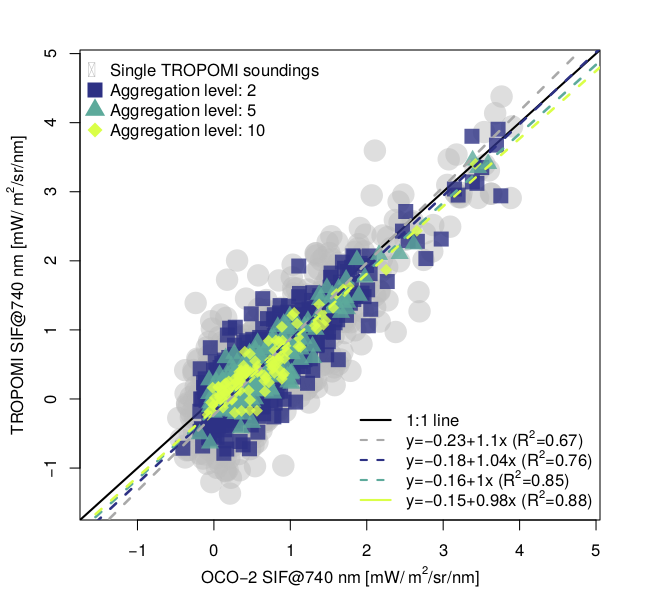

# SIF tools in [R](https://www.r-project.org/)
## TROPO_app_time-series.r

Is a [shiny app](https://shiny.rstudio.com/) to loop through [ungridded TROPOMI SIF data](ftp://fluo.gps.caltech.edu/data/tropomi/ungridded/).
You can subset time series for custom locations and test how filtering/normalizing affects the data availability and seasonality.

The script should be very straight forward to use after installing a few packages:
+ "shiny",
+ "data.table",
+ "ncdf4",
+ "solaR"

Just replace the directory in line 25 with the directory where you stored the ungridded TROPOMI data.

## TROPO_time_series_kmz.r

Is a standalone script looping through [ungridded TROPOMI SIF data](ftp://fluo.gps.caltech.edu/data/tropomi/ungridded/) and subset data over regions defined by kml/kmz files.

The script
+ pulls data from `*.nc` files
+ computes the fractional coverage of single TROPOMI footprints intersecting with the shape in the kmz file(s)
+ exports the data as `*.txt` file(s)
+ generates quicklook(s) of single soundings and specified aggregation levels in time

Following packages are required:
+ "data.table"
+ "ncdf4"
+ "solaR"
+ "rgdal"
+ "raster"

## intersensor-comparison_small_vs_big_footprints.r
Script to co-locate and compare data from different satellite sensors for cases where one satellite has a bigger footprints than the other.

Requires manual input and `intersensor_comparison_helpers.r`
See comments within the script for details.
Final output will look like Fig. 4 from the first [TROPOMI paper]( https://doi.org/10.1029/2018GL079031):

## intersensor-comparison_helpers.r
Script with functions necessary for satellite intercomparison
